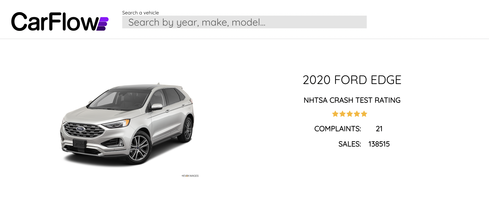

# CarFlow

### What is CarFlow?
CarFlow is a web application that provides useful information for a car model, such as its yearly sales, the number of complaints received, and other important consumer or safety information. I came up with this project in the wake of the COVID-19 pandemic, which has crippled the global supply of cars and have made new and used car prices higher than ever. My goal with CarFlow is to help consumers learn more about the cars they are considering before making a purchase, as well as potentially help automakers determine which issues are affecting their cars the most and address those problems in the future.

CarFlow App: [Link to Interact with CarFlow](https://carflow-frontend.ue.r.appspot.com/)
GitHub Page: [https://matzomt.github.io/CarFlow/](https://matzomt.github.io/CarFlow/)

To search a model on CarFlow, use the search bar at the top. Input a desired model based on year, automaker, and model name. Once you select a particular car model, the page will update and reflect the information stored for that model.

### What information does CarFlow provide?
CarFlow currently uses information from the National Highway Traffic Safety Administration (NHTSA) to provide detailed information on complaints submitted to NHTSA about a particular car model by car owners. NHTSA is an agency of the U.S. federal government and is a part of the Department of Transportation. Information used by CarFlow from NHTSA includes the types of complaints car owners submit, the number and type of complaints reported, and crash test ratings. CarFlow also uses sales information provided by CarSalesBase to display the sales of a car model over its lifetime or for a specified model year.

CarFlow will also visualize information relating to complaint types and sales and complaints statistics over a car model's lifetime.

### What technologies does CarFlow use?
The frontend of CarFlow uses React JS and HTML/CSS. The backend utilizes Python for parsing data on the web for car information via parsing JSON responses or web parsing. Python's Flask framework is also used as a REST API that communicates between the frontend and a MySQL database containing the number of complaints and sales for car models. To deploy this project, I used Google Cloud Platform (GCP), where I had to individually deploy the frontend, backend, and database.

Specific libraries and technologies used for this project are as follows:

JavaScript
- React JS
- Recharts

Python
- BeautifulSoup
- Flask

SQL
- MySQL

Google Cloud Platform (GCP)
- App Engine
- Cloud SQL

### Sources
- National Highway Traffic Safety Administration (NHTSA): Used API to find number of complaints, recalls, investigations of a car
- CarSalesBase: For finding sales information for cars sold in the United States

### About the Creator
My name is Matthew Tzou and I am a fourth-year student at the University of Georgia with an expected graduation date of December 2022. I spend a lot of time browsing used cars or following new developments in the automotive industry, and these interests are one of the motivations for creating this project. Please reach out to me in the contact information below if you would like to connect or ask me more questions about this project.

Email: mdt.tzou@gmail.com

LinkedIn: www.linkedin.com/in/matthew-tzou/
